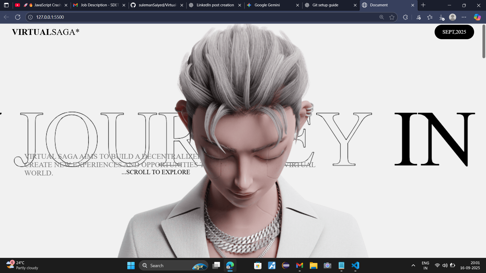

# Virtual Saga 🌐

A futuristic, metaverse-inspired landing page featuring smooth scrolling, animated text, and immersive visuals.

 <!-- screenshot stored in the review folder -->

## 🚀 Overview
**Virtual Saga** is an experimental front-end project that combines modern web design techniques to create a visually striking landing page. Inspired by metaverse concepts, it blends smooth scrolling, animated headlines, and dynamic visuals to deliver an engaging experience.

## ✨ Features
- Futuristic landing page design.
- **Locomotive Scroll** integration for seamless scrolling effects.
- Animated headlines and text transitions.
- Character/graphic sprites rendered via `<canvas>` for immersive visuals.
- Responsive layout for desktop and mobile.

## 🛠️ Tech Stack
- **HTML5**
- **CSS3** (custom animations)
- **JavaScript**
- [Locomotive Scroll](https://github.com/locomotivemtl/locomotive-scroll) for smooth scrolling.

## 🌐 Live Demo
You can view the live project here: [https://sulemansaiyed.github.io/Virtual-Saga/](https://sulemansaiyed.github.io/Virtual-Saga/)

## 📂 Project Structure
